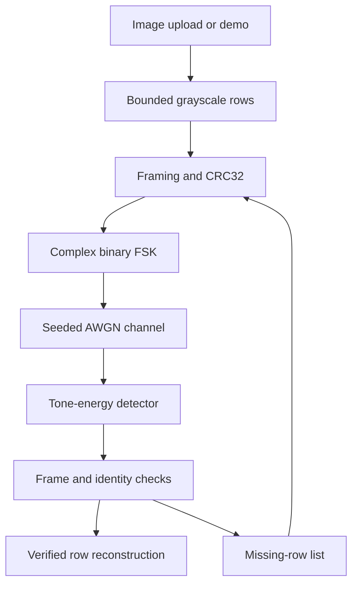

# PixelLink — archived simulator documentation

This document describes only the preserved legacy image simulator and optional Pluto receive adapter, not the default ESP32 + CC1101 telemetry system. Hardware setup and current commands are documented in the root README. In particular, the legacy “no code transmits” statements below apply to this simulator/Pluto subsystem, not the separately armed transmitter firmware.

**A small signal. A complete picture.**

PixelLink is a standalone local image-over-binary-FSK laboratory. Upload a picture, turn up the noise, watch CRC-verified rows rebuild it, then selectively retransmit what was lost. It uses actual NumPy waveform generation, complex AWGN, tone correlation, binary decoding, and CRC validation—not a probabilistic packet-drop animation.

Python's standard-library HTTP server serves an offline, vanilla HTML/CSS/JavaScript dashboard. NumPy and Pillow are the only runtime dependencies. No CDN, external service, radio transmission, or code from the neighboring FSK-Demodulator project is involved.

## Start

Python 3.10 or newer:

```sh
cd /Users/harvardsummer/PixelLink
python3 -m venv .venv
source .venv/bin/activate
python -m pip install -e .
python -m pixellink simulate --port 8000
```

Open `http://127.0.0.1:8000`. Stop with Ctrl+C. The server binds **only** to IPv4 loopback. Use the exact localhost URL; exposing it through a proxy is unsupported.

1. Leave the demo selected, SNR at **0 dB**, seed at **7**, and auto retries at **0**.
2. Click **Transmit image**. Usually some rows remain missing; checkerboard is a missing-data marker, not decoded noise.
3. Increase SNR to **20 dB** and click **Retry missing packets**. The existing session retains good rows and transmits only missing ones. A completed image is compared byte-for-byte with the normalized source.
4. Try −8 dB or −18 dB to see severe loss, or enable 1–8 automatic extra passes. Seed and image determine repeatable runs with the same sequence of channel settings. Identical seeds are reproducible within a compatible NumPy environment; they are not a cross-version interchange contract.

The file chooser accepts PNG, JPEG, WebP, and BMP up to 4 MiB. Source geometry is limited to 16 million pixels; normalized images fit inside 192 × 192 while preserving aspect ratio, use EXIF orientation, and become 8-bit grayscale. The first frame of animated inputs is used. Exact pixel integrity refers to this normalized grayscale image, not the original color file or its compression bytes.

## Command line

```sh
# Demo with selective repeat; output paths must not already exist.
python -m pixellink demo --snr 0 --seed 7 --retries 3 --output received.png

# Clean uploaded-image loopback with a first-pass capture.
python -m pixellink demo --image photo.png --snr 20 --retries 0 \
  --output clean.png --export-iq clean.iq

# Decode that saved capture offline.
python -m pixellink import-iq clean.iq --output imported.png

# Python standard-library tests; Node is optional for frontend tests.
python -m unittest discover -s tests -v
node --test tests/frontend.test.cjs
```

`demo` prints JSON statistics. A partial reception is a legitimate simulation result and exits successfully; inspect `exact`/`missing`. Invalid inputs and existing output files exit with status 2. Export/import uses exclusive file creation to avoid replacing your captures. PNG output is also exclusive. If PNG creation fails after successful IQ export, the completed capture remains available.

### Capture format

`clean.iq` contains little-endian complex64 (`<c8`), interleaved 32-bit real/imaginary components, and no file header. `clean.iq.json` records format version, sample rate, samples/symbol, tones, image geometry, transfer identity, exact per-packet sample counts, seed, SNR, and SHA-256 of the IQ bytes. Export always records a reproducible **first pass**, not the accumulated retry history. It contains noisy received samples, not clean transmit samples.

Import validates metadata, geometry, finite samples, total size, packet boundaries, modem parameters, file SHA-256, each packet CRC, and the final content identity when complete. Files are bounded to about 42 MiB. Unverified rows remain checkerboard. A SHA-256 mismatch is a file-integrity error and aborts import; AWGN losses within an intact file are normal packet failures. SHA-256 and CRC here are integrity checks, not authentication of hostile senders.

## Architecture



### Binary packet

All integers use network byte order. A packet contains exactly one image row:

| Field | Bytes | Meaning |
| --- | ---: | --- |
| Magic | 4 | ASCII `PXLK` |
| Version | 1 | `1` |
| Transfer identity | 8 | First 8 bytes of SHA-256 of big-endian width/height plus normalized pixels |
| Sequence | 2 | Zero-based image row |
| Packet count | 2 | Image height |
| Width | 2 | 1–192 pixels |
| Height | 2 | 1–192 rows |
| Payload length | 2 | Must equal width |
| Payload | width | Raw grayscale row bytes |
| CRC32 | 4 | `zlib.crc32` over all preceding header and payload bytes |

Header size is 23 bytes; framing overhead is 27 bytes per row. Receiver validation checks exact length, magic/version, geometry, sequence, payload size, CRC32, and expected transfer identity. Duplicate identical packets are idempotent; conflicting duplicates are rejected. A valid frame from another transfer cannot enter the current image. Identity is deterministic content identification, not a secret session token.

### Modem and timing assumptions

- Complex baseband at **48,000 samples/s**, **16 samples/bit**, **3,000 bit/s**. Bit 0 is −3,000 Hz; bit 1 is +3,000 Hz. Bytes are MSB-first.
- Each tone makes one whole cycle per symbol, and their 6 kHz separation is twice the symbol rate. References are orthogonal over each 16-sample symbol.
- Modulation uses unit-amplitude complex exponentials. Per-symbol construction joins at the same phase because each tone completes an integer number of cycles.
- Demodulation compares squared magnitudes of the two complex correlations: noncoherent energy detection. A constant unknown phase does not change the decision.
- SNR means unit signal power divided by **total complex noise power per sample**, not Eb/N0. Independent real and imaginary Gaussian components each have variance `10**(-SNR/10)/2`.
- **Packet boundaries, byte lengths, sample clock, symbol start, frequency, and nominal timing are known by the simulation.** There is no preamble search, carrier-offset correction, timing recovery, multipath, oscillator drift, FEC, ADC clipping, or over-air acquisition.
- Selective-repeat control is an ideal, error-free in-process missing-row list; ACKs are not modulated. Retries receive independent noise from the advancing seeded generator. There are no fake bit repairs and no combining of failed payloads.
- The UI replays actual completed server events progressively. It is not streaming live DSP or synchronized to RF airtime. Reduced-motion settings skip delays.

### Reading the dashboard

**BER** counts wrong decoded bits over *every transmitted bit*, including headers and CRCs and failed/retried attempts. It uses the simulator's known transmit reference; an independent real receiver generally cannot measure this directly.

**Rejected attempts** and its percentage count frame/CRC failures over all attempts. **Missing rows** is residual loss after all retries, not the same metric. **Exact match** requires complete reception and an actual normalized-pixel comparison.

**Signal time** is transmitted bits × 16 / 48,000; it excludes packet gaps, ACK airtime, processing, and UI replay delays. Waveform shows the first 256 received samples of the first attempted packet in the latest pass. I is mint, Q is blue, amplitude auto-scales. Spectrum is a 2,048-sample Hann-windowed FFT, shifted, normalized by 2,048, displayed as `20 log10(abs(FFT)/2048)`, sampled every eight bins. Values are relative dB, not calibrated RF power; the display spans −80 to +10 dB. No window-gain compensation is applied.

## Local HTTP interface and safety

- `GET /api/config`: returns local request token and image limits.
- `POST /api/transfer`: JSON `{ "snr": 0, "seed": 7, "retries": 0 }`; optional `image` is raw base64 without a data-URL prefix. Returns a new `session`, normalized TX/RX PNG data URLs, packet events, accepted rows, the full canonical `rows` map (sequence to base64 row payload), waveform/spectrum, and statistics. The UI reconciles that complete snapshot after event playback, including when an earlier response was lost.
- `POST /api/retry`: JSON `{ "session": "…", "snr": 20, "retries": 0 }`. A pass sends only missing rows; `retries` adds up to eight more passes.
- Both POST routes require `Content-Type: application/json`, a single `Content-Length`, and `X-PixelLink-Token` from config. Chunked requests are rejected.

The Host allowlist and Origin checks restrict browser requests to `127.0.0.1`/`localhost` with the actual port. A random per-server request token prevents cross-origin form submission; no CORS permission is granted. Static routing is an explicit allowlist—no path-based file serving. CSP disallows external assets, framing, inline scripts, and form submissions. Uploaded images stay in memory; no user-supplied filenames are used. Sessions are memory-only, expire after 30 minutes, and are capped at eight; the oldest is evicted. Each transfer allows at most 32 attempted passes, HTTP bodies at most 6 MiB, and accepted sockets have a 10-second I/O timeout.

This is a single-user educational server, not a production service or sandbox. Requests are processed serially to bound simultaneous DSP memory and protect session updates; a slow local request can delay others. Do not expose it to other hosts or untrusted local users. CRC32 does not protect against deliberate packet forgery. The dashboard and simulation use only the loopback web server. The optional, explicitly invoked hardware capture command connects to its specified device URI.

## Hardware boundary

**No code transmits over the air.** An optional receive-only Pluto adapter captures a bounded, unaligned block using pyadi-iio. It is mock-tested only: no physical device was tested. The normal dashboard/CLI simulation does not import the optional SDR dependency or connect to hardware.

```sh
python -m pip install -e '.[pluto]'
# Set DEVICE_URI and RX_FREQUENCY_HZ deliberately for your receive setup.
python -m pixellink capture-pluto --uri "$DEVICE_URI" \
  --frequency "$RX_FREQUENCY_HZ" --sample-rate 1000000 \
  --samples 65536 --gain 20 --output pluto.c64
```

Both URI and receive frequency are required; there is no automatic device discovery or tuning default. A working libiio installation and suitable device connectivity are separately required. The adapter configures RX only, reads one bounded capture, destroys the RX buffer, and writes complex64 plus metadata with exclusive creation. Its raw capture format is deliberately distinct from simulated framed IQ. **Do not pass raw Pluto captures to `import-iq`:** they have no known packet/symbol boundaries and need future resampling, frequency correction, preamble acquisition, and symbol timing before packet checks.

The hardware adapter accepts sample rates 521,000–20,000,000 samples/s, 128–1,048,576 samples, and gain 0–60 dB; the hardware driver performs final device-specific range checks. Its default 1 MHz rate is distinct from the simulation's 48 kHz. Capture files contain actual hardware settings and are not claimed to be directly interoperable with this simulator.

A safe future architecture keeps capture separate from offline synchronization and decoding. Physical RF experiments need an explicit frequency/gain plan, suitable isolation, and legal authorization; no transmission experiment is initiated here. The adapter follows the official pyadi-iio buffer, connectivity, and AD936x interfaces. Reference locations:

```text
https://analogdevicesinc.github.io/pyadi-iio/buffers/index.html
https://analogdevicesinc.github.io/pyadi-iio/guides/connectivity.html
https://github.com/analogdevicesinc/pyadi-iio/blob/main/adi/ad936x.py
```

## Project map

- `pixellink/core.py`: normalization, framing, CRC, binary FSK, AWGN, receiver, selective repeat.
- `pixellink/files.py`: bounded regular-file reads, rejecting devices and FIFOs.
- `pixellink/hardware.py`: optional explicit receive-only Pluto capture.
- `pixellink/offline.py`: complex64 capture export/import and validation.
- `pixellink/server.py`: loopback HTTP routes, input limits, session lifecycle.
- `pixellink/static/`: self-contained responsive dashboard, canvas plots and event playback.
- `pixellink/__main__.py`: CLI.
- `tests/`: deterministic modem, framing, capture, image and HTTP regression tests, plus frontend integration tests.

Built independently in this directory. No git repository initialization is required.
